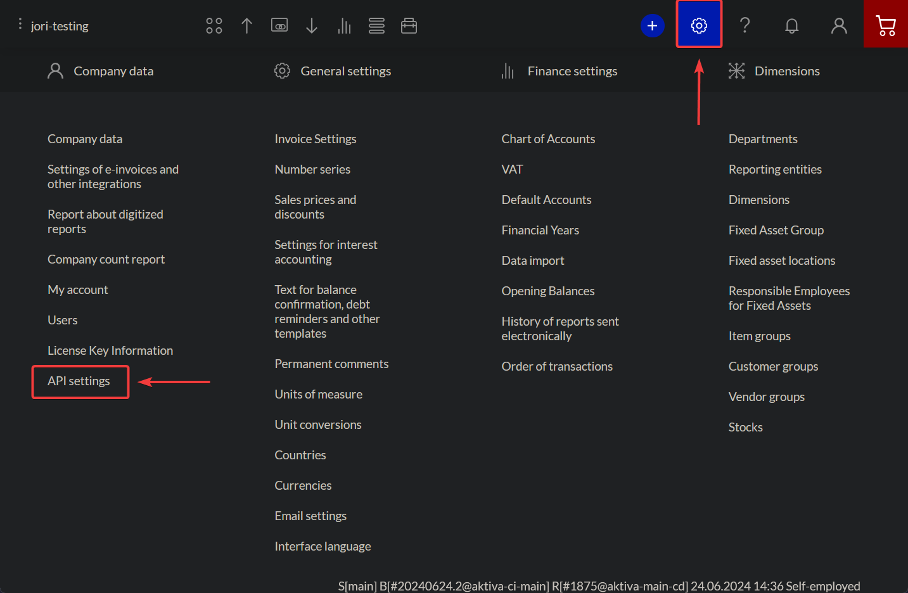

# Authentication
---
For your company, you'll be given a unique Api ID and Api Key. The admin user can  generate and reset API ID and Key on the [Settings](https://app.passelimerit.fi/settings) >> API Settings.



There you just input the comment for the key and click "Create", The comment can be anything you like, it's just for your reference.


>The images are slightly altered to make them fit the page better. The actual UI might look slightly different, but the functionality is the same.
---
>[!IMPORTANT]
>_**Keep your Api ID and Api Key secret**_. They should be guarded just as you would your regular account password. If you feel your ID and Key has been compromised, you can reset it by deleting and re creating a >new ID and Key.

For every API request you make, you'll need to include `ApiId`, `timestamp` and `signature` as request parameters.

`Signature` is in `Base64` format and is calculated using your `ApiKey` with `HMAC-SHA-256`, based on the `ApiId` + `timestamp` + `RequestJSON`.

```js{13-15}
function getTimestamp () {
  var d = new Date();
  var yyyy = d.getFullYear();
  var MM = pad2(d.getMonth() + 1);
  var dd = pad2(d.getDate());
  var HH = pad2(d.getHours());
  var mm = pad2(d.getMinutes());
  var ss = pad2(d.getSeconds());
  return yyyy + MM + dd + HH + mm + ss;
}

var timestamp = getTimestamp();
var dataString = ApiId + timestamp + JSON.stringify(reqJson); 
var hash = CryptoJS.HmacSHA256(dataString, ApiKey);           
var signature = CryptoJS.enc.Base64.stringify(hash);           

console.log(dataString);
console.log(hash);
console.log(signature);

var url = 'https://app.passelimerit.fi/api/v1/sendinvoice' + '?ApiId=' + ApiId + '&timestamp=' + timestamp + '&signature=' + signature;
```

You can check if your signing is correct from API settings. "SigningStatus" column can have value "OK" or "Insecure: " with UTC date when last incorrectly signed API request occured.

> [!IMPORTANT]
> HMAC-SHA-256 should be encoded to Base64 from raw data. [Here you can see example, what's the difference.](https://stackoverflow.com/a/32188410) <!--https://stackoverflow.com/questions/32188149/difference-between-cryptojs-enc-base64-stringify-and-normal-base64-encryption-->